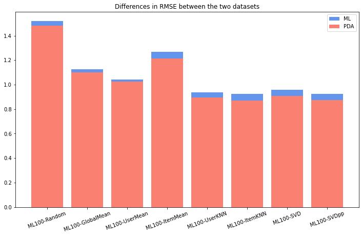
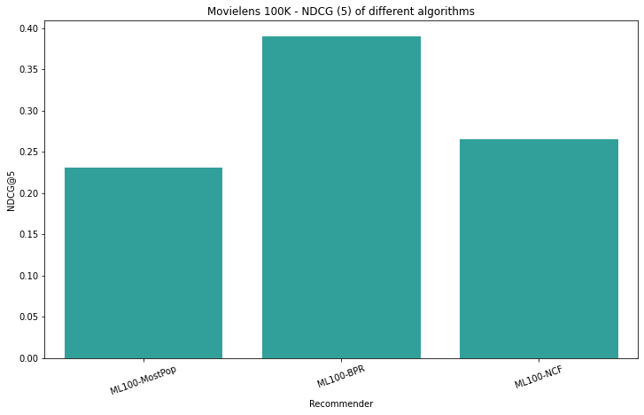
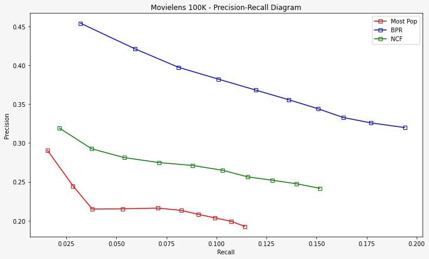

# RecSys 2019-2020 Final Project:
Evalutation and usage of various Rating prediction and Item Recommendation algorithms.

*By Geri Skenderi and Luca Bellinazzi.*

## Table of contents
- [RecSys 2019-2020 Final Project:](#recsys-2019-2020-final-project)
  - [Table of contents](#table-of-contents)
  - [Getting started](#getting-started)
    - [Prerequisites](#prerequisites)
    - [Installing the required packages](#installing-the-required-packages)
  - [Project structure](#project-structure)
  - [Results](#results)
    - [Rating Prediction (using Surprise)](#rating-prediction-using-surprise)
    - [KNN Item Recommendation (using Surprise + our evaluation metric functions)](#knn-item-recommendation-using-surprise--our-evaluation-metric-functions)
    - [Item Recommendation (using Cornac + Microsoft Recommender Utilities)](#item-recommendation-using-cornac--microsoft-recommender-utilities)
      - [Comments on the tasks and our results](#comments-on-the-tasks-and-our-results)
  - [Fullfillment of project requirements](#fullfillment-of-project-requirements)
  - [Future Work](#future-work)
  - [Charts](#charts)

## Getting started

### Prerequisites
This project uses *pipenv* for dependency management and virtual environment management.

If you do not have pipenv installed you can install it using: 
- `brew install pipenv` 
- `pip install --user pipenv`

For other installation options check out [the pipenv installation docs](https://pipenv-fork.readthedocs.io/en/latest/install.html#installing-pipenv).

### Installing the required packages

!You can follow this procedure only after you have installed pipenv and cloned the repository!

Navigate to the root directory where the *Pipfile* is located. The *Pipfile* is where pipenv stores package information. To create a Python virtual environment and install all the packages simply run `pipenv install`.

After that process is finished you will see that a *Pipfile.lock* file has been created. The virtual environment with all the needed packages is now ready to use. You can access it by using `pipenv shell`. To exit the virtual environment simply use `exit`. 

Once the virtual environment is activated you can run any Python command you prefer. To access the notebooks, run the `jupyter-notebook` command and then the Jupyter window will open in your browser (by default in port 8888).

You can check examples and other commands you can use with pipenv by simply running `pipenv`.

## Project structure
There are 3 main directories that make up this project:

1. **implementations_from_scratch**: In here you can find our from-scratch implementations of some of the algorithms that we used. It was useful for us to see and understand how the algorithms and recommendation techniques worked on a low level before moving on to using various libraries. The varous implementations include two KNN collaborative filtering algorithms (user and item based), an implementation of Matrix Factorization, Neural Collaborative Filtering and BPR based on Keras:
2. **notebooks**: This directory contains the code divided by the category of the algorithms that we have used in this project. In each notebook there is a detailed implementation along with evaluation and most importantly **Grid Search** for the bigger models:
   1. Basic-Algorithms: Code for Random Predictios, User, Item and Global Mean Predictors using [Surprise](https://github.com/NicolasHug/Surprise)
   2. Bayesian-Personalized-Ranking: Implementation of BPR using [Cornac](https://github.com/PreferredAI/cornac)
   3. KNNCF-Prediction: Code for KNN Collaborative Filtering algorithms, used for *Rating Prediction*. Implemented using [Surprise](https://github.com/NicolasHug/Surprise)   
   4. KNNCF-Recommendations: Code for KNN Collaborative Filtering algorithms, used for *Item Recommendation*. Implemented using [Surprise](https://github.com/NicolasHug/Surprise)
   5. Bayesian-Personalized-Ranking: Implementation of NCF/NeuMF using [Cornac](https://github.com/PreferredAI/cornac)
   6. SVD: Implementation of SVD, a Matrix Factorization algorithms. Contains also code for SVD++. Implemented using [Surprise](https://github.com/NicolasHug/Surprise)
3. **final_notebooks**: This directory contains three notebooks, one is just to create the charts you can see in the [images](#images) section and the other two contain the code for running all the different models, based on the task they were created for.
   1. **Rating-Prediction**: In this notebook you can run and experiment with all the *Rating Prediction* algorithms. The notebook generates a results table in the end which you can use to see how the various models perform and compare them to one-another.
   2. **KNN-Item-Recommendation-Surprise**: In this notebook you can run and experiment with all KNN Top-N Recommender algorithms. The notebook generates a results table in the end which you can use to see how the various models perform and compare them to one-another.
   3. **Item-Recommendation_Cornac**: In this notebook you can run and experiment with all the Item Recommendation except *KNN Recommenders* algorithms. The notebook generates a results table in the end which you can use to see how the various models perform and compare them to one-another. For our final implementations with we also decided to power up Cornac with the very hand [Microsoft Recommender Utilities](https://github.com/microsoft/recommenders/tree/master/reco_utils).

The code inside the notebooks is well documented and understandable. The use of libraries allowed us to perform the evaluation procedures in the same place for the different classes of algorithms (with the exception of the KNNCF for Item Recommendation which is not implemented and evaluated with Cornac unlike the other Item Recommendation models).

## Results
We have denoted the movielens dataset as ML100 and the PDA dataset as PDA2018.
Below follow the results of our work for this project. 

### Rating Prediction (using Surprise)
   
| Recommender        | RMSE  | MAE   | LibRec RMSE  | LibRec MAE   | 
|:-------------------|:------|:------|:-------------|:-------------|
| ML100-Random       | 1.527 | 1.228 | -            | -            |
| ML100-GlobalMean   | 1.126 | 0.945 | 1.126        | 0.945        |
| ML100-UserMean     | 1.042 | 0.835 | 1.042        | 0.835        |
| ML100-ItemMean     | 1.283 | 1.040 | 1.025        | 0.817        |
| ML100-UserKNN      | 0.939 | 0.733 | 0.944        | 0.737        |
| ML100-ItemKNN      | 0.922 | 0.721 | 0.924        | 0.723        |
| ML100-SVD          | 0.959 | 0.761 | 0.936        | 0.730        |
| ML100-SVDpp        | 0.924 | 0.720 | 0.912        | 0.718        |
| PDA2018-Random     | 1.481 | 1.185 | -            | -            |
| PDA2018-GlobalMean | 1.100 | 0.911 | -            | -            |
| PDA2018-UserMean   | 1.024 | 0.814 | -            | -            |
| PDA2018-ItemMean   | 1.204 | 0.979 | -            | -            |
| PDA2018-UserKNN    | 0.895 | 0.698 | -            | -            |
| PDA2018-ItemKNN    | 0.871 | 0.680 | -            | -            |
| PDA2018-SVD        | 0.908 | 0.717 | -            | -            |
| PDA2018-SVDpp      | 0.873 | 0.677 | -            | -            |

### KNN Item Recommendation (using Surprise + our evaluation metric functions)

| Recommender     |    Pre@5 |   Pre@10 |    Rec@5 |   Rec@10 |   NDCG@5 |   NDCG@10 |
|:----------------|---------:|---------:|---------:|---------:|---------:|----------:|
| ML100-UserKNN   | 0.335922 | 0.342011 | 0.308369 | 0.454819 | 0.514365 |  0.448701 |
| ML100-ItemKNN   | 0.331019 | 0.376929 | 0.298958 | 0.495591 | 0.415851 |  0.376731 |
| PDA2018-UserKNN | 0.334953 | 0.336993 | 0.312055 | 0.45544  | 0.534725 |  0.464452 |
| PDA2018-ItemKNN | 0.328328 | 0.379933 | 0.296599 | 0.496497 | 0.432044 |  0.391645 |

### Item Recommendation (using Cornac + Microsoft Recommender Utilities)

| Recommender     |    Pre@5 |   Pre@10 |     Rec@5 |   Rec@10 |   NDCG@5 |   NDCG@10 |
|:----------------|---------:|---------:|----------:|---------:|---------:|----------:|
| ML100-MostPop   | 0.21617  | 0.192553 | 0.0706593 | 0.114259 | 0.2305   |  0.220767 |
| ML100-BPR       | 0.363362 | 0.309915 | 0.12789   | 0.209184 | 0.389562 |  0.369578 |
| ML100-NCF       | 0.254    | 0.235766 | 0.0844287 | 0.149687 | 0.265001 |  0.266357 |
| PDA2018-MostPop | 0.21617  | 0.192553 | 0.0706593 | 0.114259 | 0.2305   |  0.220767 |
| PDA2018-BPR     | 0.338213 | 0.288064 | 0.121397  | 0.198045 | 0.361512 |  0.344191 |
| PDA2018-NCF     | 0.253489 | 0.235872 | 0.0846865 | 0.150544 | 0.259739 |  0.263504 |

#### Comments on the tasks and our results
- As it can be seen from the tables above the rating prediction task was successful. The implementations here worked well and by tweaking the libraries we obtained great results. The Item recommendation task has also produced relatively good results. We managed to drop down the precision and recall to the norms using our own evaluation metrics and Surprise for the model.

- We can see a clear trend in the third table regarding Top-N reccomendations. BPR is clearly the best model and that is what we expect, followed by NCF and then the Most Popular baseline. This is on par with the LibRec evaluation. Please do note that the second and third table have been evaluated slightly differently, hence the difference in the Recall and NDCG. We are using two different libraries and that is why we separated the tables. The lower than ususal NDCG and Recall attributes in the third table are results of the Cornac evaluation policy. You can check out [this issue in their official repository to better understand](https://github.com/PreferredAI/cornac/issues/323). When looking at KNN algorithms with Cornac we got very very low results so we decided to use a variation with Surprise also for the item recommendation task.

## Fullfillment of project requirements
1. **Performing Grid-Search (points 1.1 and 2.1)**: To see the various Grid Search runs you can check out the single algorithm implementations in the [notebooks](notebooks/) directory. When single-handidly studying the algorithms we performed Grid search for hyperparameter tuning on most of them, while also running cross validation afterwards.
2. **Results of Prediction and Recommendation (1.2 and 2.2)**: To see the results of the recommender algorithms you can check out the complete implementations in the [final_notebooks](final_notebooks/) directory. They wrap up all the algorithms (divided by purpose as mentioned before) in one place and that's where the results in the two tables from our [Results](#results) table come from.
3. **Extras**: We also tried to implement several algorithms from scratch, using only minimal help from libraries acting as building blocks for our algorithms. We've also added a couple of charts to make the results "visible".

## Future Work
1. **Graph-based implementations**: It would be a great to also try and implement collaborative filtering using graph implementations. We know that we can also compute collaborative filtering exercises using graph methods and that would be a great way to display the power of graph implementations.
2. **Statistical significance testing**: Even though we have used 5-fold cross validation for all the evaluation and the data does not vary by a lot (means of both datasets are very similar) the results we are getting are probably significant, but still the only way to formally make sure of this is by doing a statistical test. An example of that would be a t-test or even pairwise t-tests to compare the results between models.

## Charts

